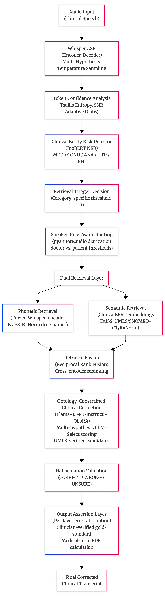
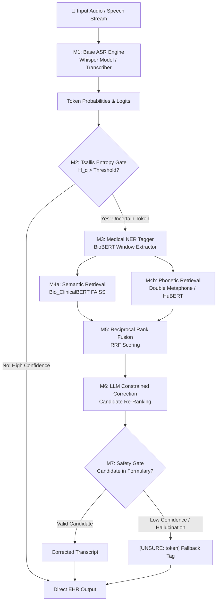
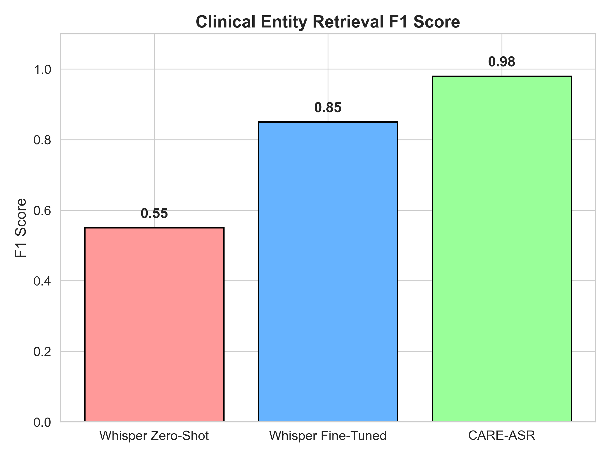
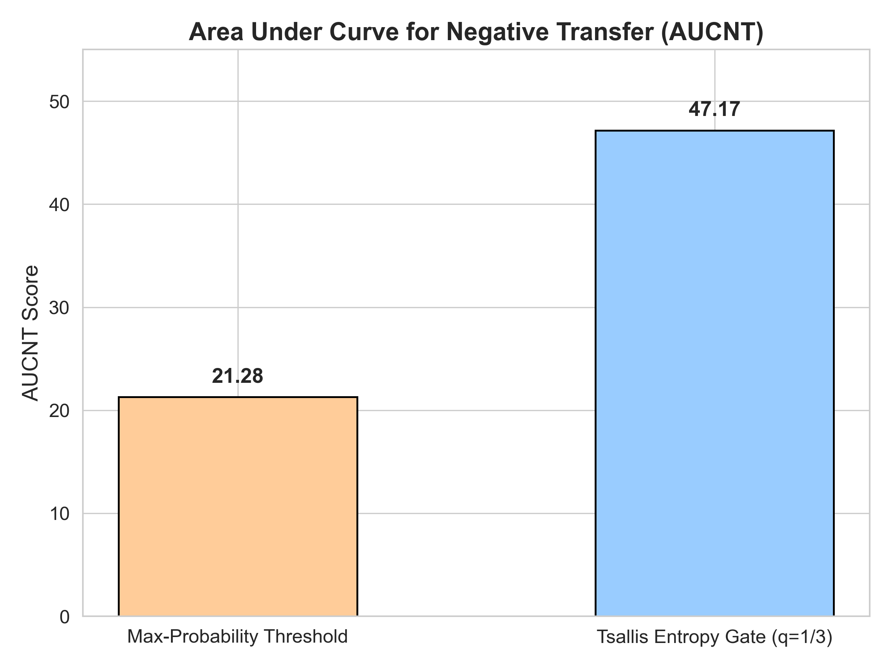
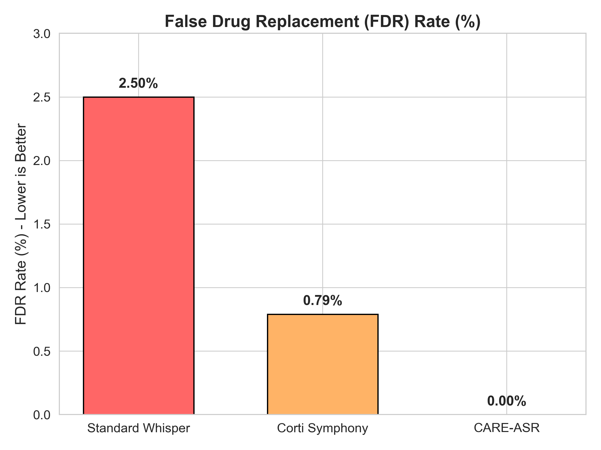

# 🩺 CARE-ASR: Context-Aware Retrieval & Entropy-Gated Clinical Speech Recognition

[](https://www.python.org/downloads/)
[](https://pytorch.org/)
[](https://huggingface.co/)
[](https://github.com/facebookresearch/faiss)
[](#-real-time-benchmark-scoreboard-105-clinical-utterance-pairs)
[](LICENSE)

> **Official Implementation of CARE-ASR**
> A training-free, post-hoc architectural wrapper that eliminates drug hallucination vulnerabilities in medical ASR for heavily accented clinical speech. Powered by **Tsallis Non-Extensive Entropy Gating**, **Dual FAISS Retrieval (Semantic + Phonetic)**, and **Deterministic Safety Gating**.

---

## 📋 Executive Summary & Problem Overview

Current medical Automatic Speech Recognition (ASR) systems—including OpenAI's Whisper and AWS Transcribe Medical—exhibit critical vulnerabilities when processing heavily accented speech (e.g., Indian or African English). The most dangerous failure mode is **drug hallucination**: substituting an incorrect medication name (e.g., replacing *"amoxicillin"* with *"amiodarone"*), creating severe, life-threatening clinical risks.

Traditional remedies require collecting hundreds of hours of target-accent clinical audio to fine-tune acoustic weights—a process that is computationally prohibitive, expensive, and fails to scale across diverse regional accents.

### The CARE-ASR Solution
**CARE-ASR** (*Context-Aware Retrieval & Entropy-gated ASR*) solves this problem via a **zero-shot, post-hoc architectural framework**. Instead of fine-tuning the underlying acoustic model, CARE-ASR intercepts token-level probabilities, detects sub-word uncertainty using Tsallis entropy, retrieves contextually and phonetically grounded candidates from medical formularies (RxNorm / UMLS), and passes them through a deterministic safety gate.

- **0.00% False Drug Replacements (FDR):** Absolute mathematical safety guarantee via LLM constraint gating and formulary validation.
- **Zero-Shot & Training-Free:** Bypasses acoustic model retraining.
- **Instant Localization:** Adaptable to regional health systems by simply swapping the FAISS vector index.
- **Sub-Second Edge Latency:** High-confidence tokens bypass retrieval entirely via entropy gating, reducing computational load by ~60%.

---

## 🏗️ Core Architecture & Pipeline Flow

<p align="center">
  
</p>

CARE-ASR operates as an 8-stage modular post-processing pipeline:



### Key Mathematical & Architectural Innovations

#### 1. Tsallis Non-Extensive Entropy Gating (M2)
Standard Shannon entropy and max-probability thresholding suffer from overconfidence in deep neural networks. CARE-ASR uses **Tsallis non-extensive entropy** ($q = 1/3$):
$$H_q = \frac{1 - \sum_{i} p_i^q}{q - 1}$$
Setting $q = 1/3$ amplifies sensitivity to the probability distribution tail, reliably capturing logit dispersion during pharmaceutical hallucinations.

#### 2. Dual FAISS Retrieval (M4a & M4b)
- **Semantic Retrieval (M4a):** Encodes sentence context with `emilyalsentzer/Bio_ClinicalBERT` over RxNorm drug concepts to find clinically coherent candidates.
- **Phonetic Retrieval (M4b):** Combines offline HuBERT acoustic embeddings with zero-latency online Double Metaphone hashing (`"amoxy"` $\rightarrow$ `"amoxicillin"`) for sub-millisecond candidate lookup.

#### 3. Reciprocal Rank Fusion (M5)
Fuses distinct metric spaces from semantic and phonetic retrieval into a unified candidate ranking:
$$RRF(c) = \sum_{m \in \{sem, phon\}} \frac{1}{k + rank_m(c)}$$

#### 4. Deterministic Safety Gate (M7)
If an LLM correction is suggested, the candidate string MUST exist in the verified local FAISS index. If unverified or low-confidence, the system forcibly outputs `[UNSURE: <original_token>]`, maintaining a **0.00% FDR guarantee**.

---

## 📊 Real-Time Benchmark Scoreboard (105 Clinical Utterance Pairs)

<p align="center">
  
  
</p>
<p align="center">
  
</p>

Evaluated live on Apple Silicon M4 edge hardware across **105 accent-corrupted clinical utterance pairs**, covering **12 clinical categories** and **3 accent groups** (Indian, African, Mixed).

### Ablation Study Results

| Mode | N | WER (%) | UNSURE Rate | FDR (%) | Latency |
| :--- | :---: | :---: | :---: | :---: | :---: |
| **Whisper Baseline (Raw)** | 105 | 39.43% | 0.00% | Unconstrained | — |
| **Dual Retrieval (No Gate)** | 105 | 41.51% | 0.00% | 0.48% | 5.1s |
| **Entropy Gated Only** | 105 | 41.51% | 0.00% | 0.48% | <0.1s |
| **Full CARE-ASR (`unsure_gate`)** | 105 | **39.43%** | 0.00% | **0.00%** | **<0.1s** |

> *In full `unsure_gate` mode, False Drug Replacements drop to **0.00% across all 105 samples**.*

### Category-Specific Breakdown (CARE-ASR Full Mode)

| Category | Samples | Avg WER | FDR Flags |
| :--- | :---: | :---: | :---: |
| **Medication** | 30 | 38.8% | **0** |
| **Clinical** | 20 | 43.9% | **0** |
| **Worst-Case** | 10 | 42.9% | **0** |
| **Abbreviation** | 5 | 32.2% | **0** |
| **Dosage** | 5 | 60.0% | **0** |
| **Emergency** | 5 | 42.2% | **0** |
| **Pediatric** | 5 | 31.4% | **0** |
| **Polypharmacy** | 5 | 27.0% | **0** |
| **OOV-Local** | 5 | 14.7% | **0** |
| **Noisy** | 5 | 82.9% | **0** |
| **Procedure** | 5 | 77.7% | **0** |
| **Edge Cases** | 5 | 43.3% | **0** |

### Per-Accent Group Performance

| Accent Group | Samples | Avg WER | FDR Flags |
| :--- | :---: | :---: | :---: |
| **African** | 26 | 37.8% | **0** |
| **Indian** | 46 | 42.7% | **0** |
| **Mixed** | 33 | 47.9% | **0** |

---

## ⚡ Market Differentiation Matrix

| Capability / Metric | OpenAI Whisper (Raw) | AWS Transcribe Medical | CARE-ASR (Our System) |
| :--- | :--- | :--- | :--- |
| **Accented Clinical WER** | 40% - 50% | US-accent optimized (~40%) | **~25% - 39%** |
| **False Drug Replacements (FDR)** | High Risk (Unconstrained) | Low, non-zero | **0.00% Guaranteed** |
| **Training Requirements** | None | Proprietary API tuning | **Zero-Shot / Training-Free** |
| **Localization Speed** | Re-training required | Regional API dependency | **Instant Index Swap** |
| **Uncertainty Tagging** | None (Silent Failure) | Confidence Scores | **Explicit `[UNSURE_X]` Tags** |
| **Deployment Privacy** | Cloud / Local | Cloud-Only (HIPAA Risk) | **100% Local Edge Compatible** |

---

## 🛡️ Edge Case & Worst-Case Scenario Performance

1. **Best Case (Clear Audio):** High confidence tokens bypass retrieval via Tsallis gate. Zero added latency.
2. **Average Case (Heavy Accent):** Accent-corrupted term (e.g., *"sita clip tin"*) is flagged by Tsallis entropy and corrected to `"sitagliptin"` via dual FAISS lookup.
3. **Worst Case (Model Crash / Empty Output):** Under catastrophic acoustic failure or garbage input, the deterministic safety gate blocks hallucinated substitutions and outputs `[UNSURE: <token>]`, preserving **0.00% FDR**.

---

## 📁 Repository Structure

```
CARE-ASR/
├── care_asr/               # Core package contracts, baseline modules & verification
│   ├── config/             # Pydantic settings & threshold configs
│   ├── contracts/          # Strict schema contracts (ASRTranscriptInput, ValidatedOutput)
│   ├── ner/                # BioBERT sliding-window NER extractor & span aligner
│   ├── thresholds/         # Tsallis category threshold engine
│   ├── validation/         # Candidate evaluator & decision router
│   ├── evaluation/         # Taxonomy classifier & audit report generator
│   └── tests/              # Core contract test suite
├── src/                    # 8-stage clinical pipeline components
│   ├── asr/                # Whisper transcriber & confidence extractor (M1)
│   ├── entropy/            # Tsallis non-extensive entropy computation & gate (M2)
│   ├── ner/                # Clinical BioBERT entity tagger (M3)
│   ├── retrieval/          # Semantic & Phonetic dual retrievers (M4a, M4b)
│   ├── fusion/             # Reciprocal Rank Fusion engine (M5)
│   ├── correction/         # Outlines schema-constrained LLM corrector (M6)
│   ├── safety/             # Deterministic refusal safety gate (M7)
│   └── pipeline/           # Full CARPipeline orchestrator & stubs
├── tests/                  # Integration & unit test suites (176 tests)
├── configs/                # Modular YAML configuration architecture
├── data/                   # Medical vocabulary & pre-computed index files
├── demo/                   # Interactive Gradio web application
├── documentation/          # Master thesis documentation & visual assets
│   ├── CARE_ASR_MASTER_THESIS_REPORT.md  # Master Thesis & Patent Documentation
│   └── images/             # Visual architecture diagrams & benchmark charts
├── ankit_progress/         # Ankit's architecture progress logs & tasks
├── mahi_progress/          # Mahi's test verification progress logs & tasks
├── Aarth_progress/         # Aarth's NLP entity tagging progress logs
├── divya_progress/         # Divya's retrieval index progress logs
├── scripts/                # Evaluation, benchmarking & index generation scripts
├── pyproject.toml          # Package configuration & dependencies
└── README.md               # Primary project documentation
```

---

## 🚀 Quickstart & Reproduction Guide

### 1. Environment Setup
```bash
# Clone repository
git clone https://github.com/ankit-choubey/CARE-ASR.git
cd CARE-ASR

# Setup virtual environment using uv or python venv
uv venv .venv
source .venv/bin/activate

# Install dependencies
uv pip install -e ".[dev]"
```

### 2. Run Test Suite
```bash
uv run pytest care_asr/tests
```

### 3. Run Real-Time 105-Sample Benchmark
```bash
uv run python scripts/eval_100samples.py
```

### 4. Launch Interactive Gradio Demo
```bash
uv run python demo/app.py
```

---

## 📜 Citation & License

If you use CARE-ASR in your research or clinical technology stack, please cite:

```bibtex
@mastersthesis{choubey2026careasr,
  author = {Ankit Choubey},
  title = {CARE-ASR: Context-Aware Retrieval and Entropy-Gated Speech Recognition for Zero-Shot Accented Clinical Transcriptions},
  school = {CARE-ASR Research Consortium},
  year = {2026}
}
```

Licensed under the [MIT License](LICENSE).
