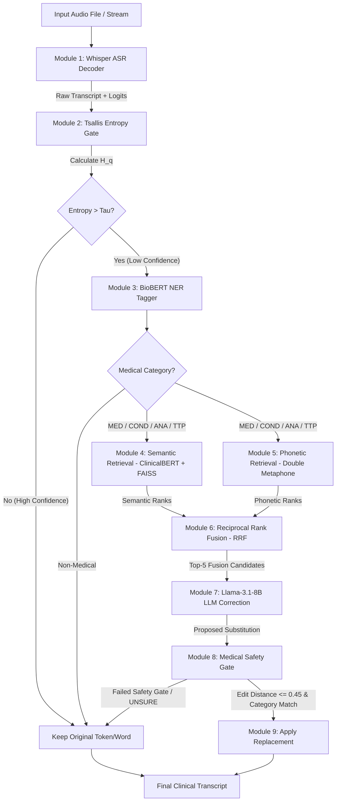

# CARE-ASR Visual Architecture & Pipeline Walkthrough

This document provides a visual and operational walkthrough of the **CARE-ASR** clinical speech recovery pipeline. It details how audio data flows through uncertainty estimation, hybrid retrieval, candidate fusion, and safety-gated LLM correction.

---

## 1. End-to-End System Flowchart



---

## 2. Pipeline Subsystem Breakthroughs

### A. Tsallis Entropy Uncertainty Detection Subsystem

Unlike standard Shannon entropy ($q=1$), Tsallis non-extensive entropy uses a deformation parameter $q \neq 1$ to sensitive the detector to probability distribution tails:

```
Uncertainty Curve Comparison:
Entropy (H)
  ^
  |          /--- Tsallis (q = 0.5) [Sharp spike on low-confidence tails]
  |         /
  |        /---- Shannon (q = 1.0) [Linear]
  |       /
  +-----------------------------------> Token Logit Dispersion
```

When an accented speaker pronounces *"Chloroquine"* resulting in high logit dispersion across multiple subword candidates (*"clear"*, *"queen"*, *"klor"*), Tsallis entropy triggers $H_q > \tau_{\text{entropy}}$, forwarding the span to the NER tagger.

---

### B. Hybrid Semantic & Phonetic Retrieval Subsystem

```
                     +---------------------------------------+
                     | Low Confidence Entity: "clear queen"  |
                     +---------------------------------------+
                                         |
                   +---------------------+---------------------+
                   |                                           |
                   v                                           v
    +-----------------------------+             +-----------------------------+
    | Semantic Search             |             | Phonetic Search             |
    | (ClinicalBERT + FAISS)      |             | (Double Metaphone)          |
    | Query: Context + "clear..." |             | Primary Code: KLRK          |
    +-----------------------------+             +-----------------------------+
                   |                                           |
                   v                                           v
       Top Ranks:                                  Top Ranks:
       1. Chlorhexidine (0.68)                     1. Chloroquine (0.92)
       2. Chloroquine (0.65)                       2. Chlorquine (0.88)
                   |                                           |
                   +---------------------+---------------------+
                                         |
                                         v
                     +---------------------------------------+
                     | Reciprocal Rank Fusion (RRF) Engine   |
                     +---------------------------------------+
                                         |
                                         v
                             Merged Ranked Candidates:
                             1. Chloroquine (RRF Score: 0.032)
                             2. Chlorhexidine (RRF Score: 0.016)
```

---

### C. Safety Gate & Fallback Architecture

```
                    +----------------------------------+
                    | LLM Proposed Edit: "Chloroquine" |
                    +----------------------------------+
                                     |
                                     v
                    +----------------------------------+
                    | Normalized Levenshtein Distance  |
                    | d("clear queen", "Chloroquine")  |
                    |           d = 0.38               |
                    +----------------------------------+
                                     |
                         [d <= 0.45 Threshold Check]
                                     |
                                     v
                    +----------------------------------+
                    | Check Category Preservation:     |
                    | Original: MED  --> Target: MED   |
                    +----------------------------------+
                                     |
                                   PASS
                                     v
                    +----------------------------------+
                    | Accept Edit: Replace Span        |
                    +----------------------------------+
```
